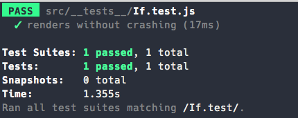
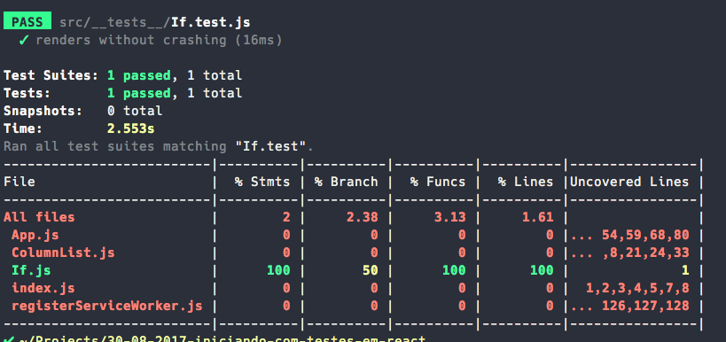
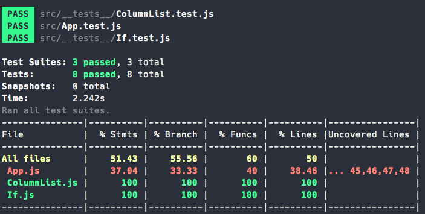
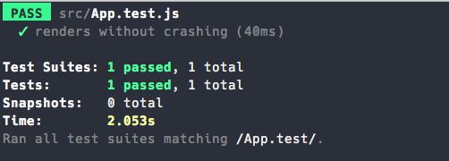
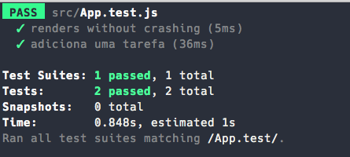

# Iniciando com testes em React

Esse é o repositório contendo o código da sessão apresentada para o React Nanodegree da Udacity Brasil.

Você pode encontrar os [slides da apresentação nesse repositório](./docs/udacity-iniciando-com-testes-em-react.pdf)


Os testes aqui escritos estão baseado no projeto [Começando com React](https://github.com/udacity/live-codings-react-nanodegree/tree/master/react-fundamentals/16-08-comecando-com-react-solution), que foi a primeira sessão apresentada para a turma do React Nanodegree.

Nesse repositório, você encontrará os exemplos finais de todos os testes necessários para atingir 100% de cobertura de código no projeto selecionado.


Abaixo, você encontrará 3 tópicos para te ajudar a escrever testes em aplicações React com o `create-react-app`:

- Cobertura de código
- Escrevendo testes
- Problemas comumns

Como vimos, o `create-react-app` já vem com o [Jest instalado e configurado](https://github.com/facebookincubator/create-react-app/blob/master/packages/react-scripts/template/README.md#running-tests), deixando tudo muito mais fácil para escrevermos nossos testes.

Jest conta com um ambiente de navegador virtualizado, utilizando [jsdom](https://github.com/tmpvar/jsdom). Veremos mais adiante, alguns problemas comuns que você pode encontrar ao testar suas aplicações React.

Seguindo as convenções do Jest, iremos criar uma pasta `__tests__` e nosso primeiro arquivo de testes, `If.test.js`:

```bash
cd src
mkdir __tests__
cd __tests__
touch If.test.js
```

Você pode ver mais exemplos na documentação do [`create-react-app`](https://github.com/facebookincubator/create-react-app/blob/master/packages/react-scripts/template/README.md#filename-conventions) (contém vários exemplos, mesmo se Inglês não é seu forte, você pode usar a opção de "traduzir página" do Chrome).

Agora, iremos copiar o conteúdo do `App.test.js` para `If.test.js` e usar o componente correto:

```javascript
// src/__tests__/If.test.js
import React from 'react';
import ReactDOM from 'react-dom';
import If from '../If';

it('renders without crashing', () => {
  const div = document.createElement('div');
  ReactDOM.render(<If />, div);
});
```

Agora, podemos executar:

```bash
# perceba o "--" entre os comandos
npm run test -- If.test
```

O resultado no seu terminal deve ser parecido com:



Para entendermos melhor, qual parte do nosso arquivo foi testada, iremos usar o parâmetro `--coverage` no nosso comando de teste e, a partir do seu resultado, tomar decisões para testar mais partes do nosso código.

## Cobertura de código

Voltando ao terminal, execute um novo comando:

```bash
npm run test -- If.test --coverage
```

Você deve ter como resultado, algo parecido com:



Olhando o resultado da nossa cobertura de código, podemos concluir que:

- 100% das nossas afirmações (segunda coluna, **% Stmts**), foram testadas
- 50% das nossas divisões (terceira coluna, **% Branch**), foram testadas
- 100% das nossas funções (quarta coluna, **% Funcs**), foram testadas
- 100% das linhas escritas (quinta coluna, **% Lines**), foram testadas
- Na sexta coluna, **caso o resultado for amarelo**, significa que alguma divisão no seu código não foi testada (no nosso caso, alguma divisão na linha 1), **caso o resultado for vermelho**, significa que uma parte do código ainda não foi testada

Para entender melhor os relatórios de cobertura de código, você pode dar uma olhada no meu artigo [Cobertura de código explicada - Relatórios e métricas com Istanbul e o que elas significam!](https://medium.com/@oieduardorabelo/cobertura-de-c%C3%B3digo-explicada-ba1516db7dbd)

Sabendo disso, vamos escrever mais testes para o nosso `If.test.js`

## Escrevendo testes

Até agora, estamos usando o exemplo do `App.test.js`, que já vem junto do `create-react-app` ao iniciar um projeto.

Apesar desse exemplo inicial ser um ótimo exemplo de **smoke tests** [1], em projetos reais, muitas vezes, nós precisamos montar uma instância do componente, interagir com ele, etc. E para testar componentes de modo isolado, uma prática comum na comunidade React é usar a biblioteca [Enzyme](http://airbnb.io/enzyme/)[2], do AirBnB.

Precisamos instalar essas depêndencias:

```bash
npm install --save-dev enzyme react-test-renderer
```

E agora, podemos re-escrever nosso `If.test.js`:

### Finalizando o If.test.js

```javascript
// src/__tests__/If.test.js
import React from "react";
import { shallow } from "enzyme";
import If from "../If";

it("renders without crashing", () => {
  shallow(<If />);
});
```

E, lembrando do resultado do relatório da nossa cobertura de código. Na linha 1 to nosso arquivo `If.js`, existe uma divisão (_branch_) do nosso código, que ainda não foi testada. Olhando no arquivo:

```javascript
// src/If.js
const If = ({ test, children }) => (test ? children : false);
// ... restante do código
```

Ah-ha! Nós temos uma afirmação condicional com `test ? children : false`. Podemos escrever um novo teste para confirmar essa etapa:

```javascript
// src/__tests__/If.test.js
// ... restante do código
it("testando o restante da condicional", () => {
  shallow(
    <If test={true}>
      <span>Test</span>
    </If>
  );
});
```

Precisamos passar um elemento `children` válido para o componente `If`, nesse caso, `span` (poderia ser qualquer tag).

Ao executar nosso relatório de cobertura de código novamente:

```bash
npm run test -- If.test --coverage
```


Aeee! 🎉🎉🎉 Meus parabéns, conseguimos alcançar 100% de cobertura de testes no `If.test.js`.

- [1] **smoke tests**, _teste de fumaça_ ou _teste rápido_, são testes que tentam validar o funcionamente do componente e/ou software, como um todo. Eles não testam funcionalidade ou lógica específica, a idéia é que, aquela parte do seu código, depois das alterações, ainda funciona no geral. Podemos comparar isso ao testar nossos sites em diferentes navegadores, muitas vezes, nós só "abrimos o site" para ver se está funcionando, isso é um **smoke test**.
- [2] Para ver mais exemplos sobre Enzyme, você pode dar uma olhada [nesse artigo](https://medium.com/@oieduardorabelo/jest-snapshot-testing-com-react-e-enzyme-faaea4c7c9c)

### Primeiros testes para ColumnList

Dando continuidade, agora vamos criar o arquivo de teste para o `ColumnList.js`:

```bash
cd src/__tests__
touch ColumnList.test.js
```

E vamos escrever um **smoke test** nele:

```
// src/__tests__/ColumnList.test.js
import React from "react";
import { shallow } from "enzyme";
import ColumnList from "../ColumnList";

it("renders without crashing", () => {
  shallow(<ColumnList />);
});
```

Executando a cobertura de código para esse novo arquivo:

```
npm run test -- ColumnList.test --coverage
```

Temos como resultado:


Você sempre pode consultar a noss análise na sessão anterior, ["Cobertura de código"](#cobertura-de-código), para entender o resultado de cada arquivo.

Porém, quero chamar sua atenção aqui para o arquivo `If.test.js`.

Nós não conseguimos 100% de cobertura de testes na sessão ["Finalizando o If.test.js"](#finalizando-o-if.test.js)? Por quê raios ele está amarelo aqui?

Ao olharmos o comando que executamos acima, iremos perceber que executamos testes e relatório de cobertura de código **apenas** para o `ColumnList.test`. Ou seja, nosso relatório está nos dizendo que: "O arquivo ColumnList.js, está usando If.js e, até o momento, apenas 50% do If.js foi executado nos testes do código do ColumnList.js".

Bacana né? Isso te dá uma idéia de onde olhar no seu código para entender o fluxo e a lógica já escritas (em caso de testes unitários), ou, em como você irá escreve-las (em caso de TDD/BDD).

Perceba também, que as linhas 21 e 24 do ColumnList estão em vermelho, ou seja, **não há nenhum teste** executando aquelas linhas.

Vamos olhar o código do ColumnList para podermos descidir quais testes escrever:

```javascript
// ... restante do código
return (
  <div className="column-list">
    <h3>{title}</h3>
    <If test={title === 'To Do'}>
      <form onSubmit={addTask}>
```

Aqui é um exemplo de pedaço de código ainda não testado. Que tal escrevermos um teste para executar o `If` no `ColumnList`?

Dessa vez, nós precisamos montar uma instância de componente React, pois o `If` é um elemento filho do nosso `ColumnList`. Para isso, iremos utilizar a [API do Enzyme chamada `mount`](http://airbnb.io/enzyme/docs/api/mount.html):

```javascript
import { shallow, mount } from "enzyme";

// ... restante do código
it("executando o If do formulário como false", () => {
  const test = mount(<ColumnList title="Done" />);
  expect(test.find("form").length).toBe(0);
});

it("executando o If do formulário como true", () => {
  const test = mount(<ColumnList title="To Do" />);
  expect(test.find("form").length).toBe(1);
});
```

- _Para ver mais exemplos sobre Enzyme, você pode dar uma olhada [nesse artigo](https://medium.com/@oieduardorabelo/jest-snapshot-testing-com-react-e-enzyme-faaea4c7c9c)_

Agora, ao gerar nosso relatório:

```
npm run test -- ColumnList.test --coverage
```

Temos como resultado:


Irado! 💪

Agora, para as linhas 21 e 24, podemos escrever:

Linha 21:

```javascript
// ... restante do código
const lista = [{ id: "123", title: "Item 1", status: "To Do" }];

it("executando linha 21", () => {
  const test = mount(<ColumnList title="To Do" items={lista} />);
  expect(test.find("li").length).toBe(1);
});
```

E a linha 24:

```javascript
// ... restante do código
it("executando linha 24", () => {
  const updateTask = jest.fn();
  const test = mount(
    <ColumnList title="To Do" items={lista} updateTask={updateTask} />
  );
  test.find("li input").simulate("change");
  expect(updateTask).toHaveBeenCalledTimes(1);
});
```

Para gerar nosso relatório:

```
npm run test -- ColumnList.test --coverage
```

Temos como resultado:


Oh-ho! Alcançamos 100% no `ColumnList.js`!! 🎉🎉🎉

Porém, se olharmos o código do nosso componente, existe uma **prop** que não foi testada, a `addTask`, isso acontece porque a execução da função, acontece em um componente pai. Como nosso projeto é simples e também não contém **propTypes** obrigatórias (_ex: addTask: PropTypes.func.isRequired_), nosso relatório de cobertura de testes nos mostra um 100% que não é bem verdade, certo? Esse teste eu irei deixar para você criar! :)

Por isso é sempre bom manter e declarar as **props** corretas dos seus componentes e nada, nada mesmo, substitui uma boa revisão de código!

## Problemas comumns

Agora, só nos falta o **App.js**, porém, se olharmos novamente o último resultado do relátio de cobertura de código:


### Arquivos indesejados

Existe alguns arquivos indesejados no resultado, tais como `index.js` e `registerServiceWorker.js`, que, com um ambiente virtualizado como o `jsdom`, fica difícil criar um teste ser usar muitos _mocks_.

Para ignorarmos esses arquivos, podemos adicionar uma configuração do Jest no nosso `package.json`:

```javascript
// ... em qualquer lugar no package.json
"jest": {
  "collectCoverageFrom": [
    "src/**/*.js",
    "!src/index.js",
    "!src/registerServiceWorker.js"
  ]
}
```

Teremos como resultado:



Bem melhor! :) Estemos dizendo ao Jest para ignorar os dois arquivos que falamos anteriormente, agora nosso relatório de cobertura de testes só inclui os arquivo que queremos!

### localStorage

Ao executarmos os testes do `App.test.js`:

```
npm run test -- App.test
```

Teremos um resultado como:


Isso acontece porque o seu componente, tem uma depêndencia interna a API `localStorage`.

Na própria documentação do `create-react-app`, existe uma [sessão falando sobre isso](https://github.com/facebookincubator/create-react-app/blob/master/packages/react-scripts/template/README.md#initializing-test-environment):

Podemos resolver esse problema executando os seguintes passos,

Vamos criar um arquivo `setupTests.js` dentro de `src`:

```bash
cd src
touch setupTests.js
```

E escrever dentro dele:

```javascript
// src/setupTests.js
const localStorageMock = {
  getItem: jest.fn(),
  setItem: jest.fn(),
  clear: jest.fn()
};
global.localStorage = localStorageMock
```

Isso irá criar um _mock_ da API localStorage na sua sessão de testes do Jest. Como estamos declarando ela no arquivo `setupTests`, esse _mock_ será compartilhado com **todos os seus arquivos de teste**.

Agora, se executarmos o `App.test` novamente:

```
npm run test -- App.test
```

Teremos:



Bem melhor! 👏

### Eventos de navegador não funcionam

Um cenário que pega muita gente de surpresa, é a expectative de que, todos os eventos do navegador, irão funcionar. Existem, ao menos, 4 camadas de abstrações nos testes de componente React:

- `jsdom` - Simula um ambiente de navegador
- `Enzyme` - Simula eventos utilizando a API do React
- [`ReactTestUtils`](https://facebook.github.io/react/docs/test-utils.html) - Biblioteca de utilitários para testar componentes React
- [`Synthetic Events`](https://facebook.github.io/react/docs/events.html) - Implementação de sistema de eventos utilizando a API do navegadores criada pelo React, possibilitando uma experiência consistente entre todos os navegadores

Um problema bem comum durante o uso do Enzyme, é a simulação do evento de `submit` de um formulário.

Em um navegador, a experiência normalmente é:

- Temos um formulário (ex: `<form>`)
- Digitamos no campo de texto (ex: `<input placeholder="Create new task" type="text" />`)
- Clicamos no botão (ex: `<button type="submit" onClick={submitForm}>`)
- O formulário é enviado (ex: `submitForm(){}`)

Vamos criar esse teste no nosso `App.test.js` e tentar executar a mesma etapa,

Substituindo o código em `App.test.js` para:

```javascript
it("adiciona uma tarefa", () => {
  const test = mount(<App />);
  expect(test.state().items.length).toBe(0);
  test.find("form input").simulate("change", "Nova tarefa");
  test.find("form button").simulate("click");
  expect(test.state().items.length).toBe(1);
});
```

Ao executar esse teste, recebemos:


No momento em que escrevo, isso acontece porque propagação de eventos não é suportado no Enzyme, isso está na lista de ["trabalhos futuros"](https://github.com/airbnb/enzyme/blob/master/docs/future.md) e também existe duas discussões bacanas no GitHub sobre isso, [aqui](https://github.com/airbnb/enzyme/issues/308) e [aqui](https://github.com/airbnb/enzyme/issues/364).

Para resolvermos isso, precisamos ter acesso ao elemento gerado pela API do React:

```javascript
it("adiciona uma tarefa", () => {
  const test = mount(<App />);
  expect(test.state().items.length).toBe(0);
  test.find("form input").node.value = "Nova tarefa";
  test.find("form button").node.click();
  expect(test.state().items.length).toBe(1);
});
```

Perceba que trocamos **apenas** a API `.simulate` do Enzyme. Ainda estamos usando `mount` para instanciar o componente.

Agora temos:



Agora você pode continuar testando! 😄

## Finalizando

É isso aí galera!

Agradeço a todos que acompanharam a sessão ao vivo, com questões e dúvidas.

Vocês podem entrar em contato através:

- Slack Udacity
- Twitter
- Ou abrir uma issue por aqui mesmo!

[];
